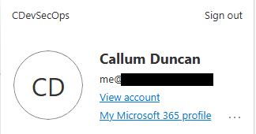

## Lab Prerequisites

As part of the lab setup, I have created an organisation to get a free trial of
`Microsoft 365 Business Premium (no Teams)`. You can create an account
[here](https://www.microsoft.com/en-us/microsoft-365/business/no-teams-plans-and-pricing?).

### What does this give me?

### Microsoft 365 Business Plan Comparison

| Feature | Business Basic | Business Standard | **Business Premium** | Apps for Business |
|---|---|---|---|---|
| Creates M365 Tenant | ✅ | ✅ | ✅ | ✅ |
| Microsoft Defender for Endpoint (Plan 1) | ❌ | ❌ | ✅ | ❌ |
| Microsoft Defender for Office 365 (MDO) | ❌ | ❌ | ✅ | ❌ |
| Device Management (Intune/MDM) | ❌ | ❌ | ✅ | ❌ |
| Entra ID P1 (Conditional Access, MFA) | ❌ | ❌ | ✅ | ❌ |
| Microsoft Purview (Data Classification) | ❌ | ❌ | ✅ | ❌ |
| Free Trial (30 days) | ✅ | ✅ | ✅ | ✅ |
| Monthly Cost (post-trial) | 💰 £4.40 | 💰 £9.29 | 💰 £18.79 | 💰 £8.25 |

> **Note:** Business Premium includes **MDE Plan 1** (antivirus, attack
> surface reduction, basic device control). **MDE Plan 2** - which adds EDR,
> Advanced Hunting (KQL), and Threat Analytics - requires a separate add-on or
> Defender for Business upgrade.

For lab context, Business Premium is the only meaningful starting point - it's
the lowest tier that bundles endpoint protection, identity controls, and device
management together.

We now have a business account set up!
